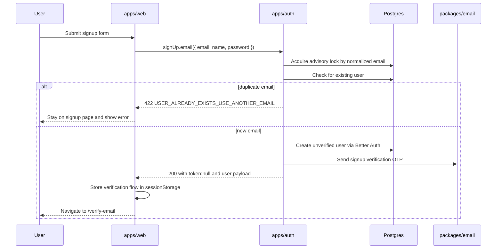
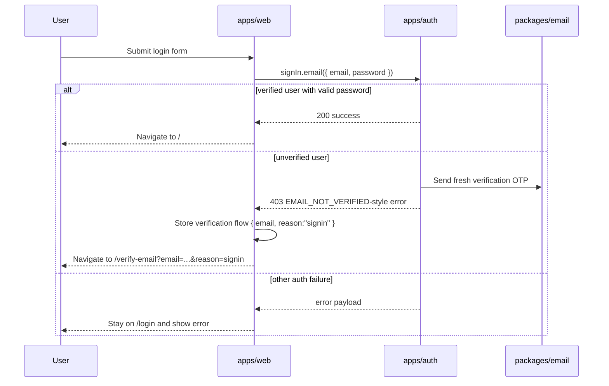
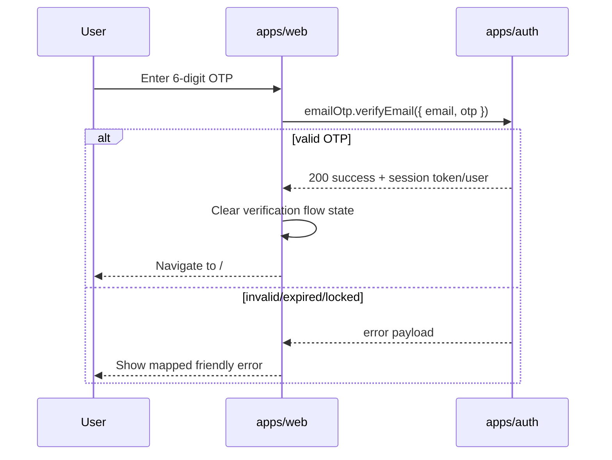

# Identity Authentication Slice

This document set explains how the current login/signup slice works across `apps/web`, `apps/auth`, `packages/email`, and `packages/db`.

It is written for two audiences:

- engineers onboarding to the repo who need the whole mental model quickly
- future agents that need the decision history, invariants, and caveats before changing anything

The slice currently covers:

- signup with email/password
- login with email/password
- email verification with a 6-digit OTP
- session display and sign-out
- password reset request and completion
- auth-owned transactional email delivery

## Read This First

1. `docs/architecture/domain-driven-feature-slices.md`
2. `docs/architecture/identity-authentication/shared-foundations.md`
3. The sub-feature doc you plan to edit:
   - `docs/architecture/identity-authentication/signup-and-account-creation.md`
   - `docs/architecture/identity-authentication/login-and-session.md`
   - `docs/architecture/identity-authentication/verify-email-and-otp.md`
   - `docs/architecture/identity-authentication/password-reset.md`

## What This Slice Owns

The identity/authentication slice is one product capability split across app boundaries:

- `apps/web` owns browser routes, auth screens, navigation, and small browser-only flow state
- `apps/auth` owns Better Auth configuration, session semantics, duplicate-signup behavior, CORS, cookies, direct DB checks, and email side effects
- `packages/email` owns reusable transactional email contracts, templates, and transports
- `packages/db` owns the shared auth schema and DB client used by the auth app

The route entrypoints stay thin. The auth service remains the canonical owner of auth rules.

## Current Top-Level Decisions

These are the decisions that shape almost everything else in the slice:

1. Signup does not create a usable session.
2. Email verification is mandatory before password sign-in.
3. OTP verification, not magic-link verification, is the current email-verification mechanism.
4. Successful verification is configured to auto-sign the user in.
5. Unverified password sign-in is not a dead end; it sends a fresh OTP and redirects into the same verify-email flow.
6. Duplicate signup is explicitly rejected with `422 USER_ALREADY_EXISTS_USE_ANOTHER_EMAIL`.
7. Duplicate rejection is serialized in the auth app with a Postgres advisory lock.
8. Resend visibility on `/verify-email` is gated by browser flow state, not by query params alone.
9. Email sending is treated as a background side effect. Delivery failures are logged, not surfaced in the primary auth response.

## Primary Happy Paths

### Signup path

### Login path

### Verify-email path

## Operational Dependency Chain

The slice only works correctly when all of these are aligned:

- auth base URL resolution in `apps/web/src/domains/identity/authentication/ui/auth-client.ts`
- runtime auth base URL injection in `apps/web/src/routes/__root.tsx`
- trusted origins from `apps/auth/src/domains/identity/authentication/infra/env.ts`
- auth CORS handling in `apps/auth/src/domains/identity/authentication/routes.ts`
- cookie SameSite policy in `apps/auth/src/domains/identity/authentication/infra/cookie-attributes.ts`
- public/runtime service URLs in Railway or local Portless setup
- shared auth schema in `packages/db/src/schema/auth.ts`
- email transport/provider wiring in `apps/auth/src/domains/identity/authentication/infra/email-service.ts`

Changing any one of those in isolation can break login, session cookies, password reset redirects, or OTP resend behavior.

## Do Not Break These Invariants

- Signup success goes to `/verify-email`, not to `/`.
- Signup success stores verification flow state in `sessionStorage`.
- Duplicate signup returns `422 USER_ALREADY_EXISTS_USE_ANOTHER_EMAIL`.
- Duplicate-signup handling is app-owned in `apps/auth`, not delegated blindly to Better Auth.
- Malformed signup payloads fall through to Better Auth validation instead of failing in the route wrapper.
- Password sign-in requires verified email.
- Unverified sign-in redirects into verify-email and stores `reason: "signin"` in the browser flow state.
- Verify-email resend UI must not trust URL params alone.
- Successful OTP verification clears stored flow state and navigates home.
- OTP email delivery is best-effort; failures are logged and swallowed.
- `packages/email` stays environment-agnostic. App env parsing belongs in `apps/auth`.

## Known Caveats

- Duplicate signup is explicit and user-friendly, but it is not enumeration-resistant.
- Resend gating is a browser UX safeguard, not hard abuse prevention.
- `sessionStorage` is tab-local and user-controlled. It is intentionally lightweight.
- Signup/login/verify-email depend on Better Auth response shapes in a few places, especially the `EMAIL_NOT_VERIFIED` handling in the web app.
- Password reset flows use a generic request response for privacy, but duplicate signup intentionally does not.
- Email delivery failures do not block the auth response, so users can land on verify-email without receiving mail if the provider fails.
- The OTP email template is reused for signup and sign-in-triggered verification sends.

## Source Map

Start with these files when you need to reason about the whole slice:

- `apps/auth/src/app.ts`
- `apps/auth/src/domains/identity/authentication/index.ts`
- `apps/auth/src/domains/identity/authentication/routes.ts`
- `apps/auth/src/domains/identity/authentication/infra/auth.ts`
- `apps/auth/src/domains/identity/authentication/infra/env.ts`
- `apps/auth/src/domains/identity/authentication/infra/cookie-attributes.ts`
- `apps/auth/src/domains/identity/authentication/infra/email-service.ts`
- `apps/web/src/routes/__root.tsx`
- `apps/web/src/domains/identity/authentication/ui/auth-client.ts`
- `apps/web/src/domains/identity/authentication/ui/login-page.tsx`
- `apps/web/src/domains/identity/authentication/ui/signup-page.tsx`
- `apps/web/src/domains/identity/authentication/ui/verify-email-page.tsx`
- `apps/web/src/domains/identity/authentication/ui/email-verification-flow.ts`
- `apps/web/src/domains/identity/authentication/ui/forgot-password-page.tsx`
- `apps/web/src/domains/identity/authentication/ui/reset-password-page.tsx`
- `packages/email/src/contracts.ts`
- `packages/email/src/service.ts`
- `packages/db/src/schema/auth.ts`

## Testing Map

These tests encode the slice behavior today:

- `apps/auth/src/app.test.ts`
- `apps/auth/src/domains/identity/authentication/routes.test.ts`
- `apps/auth/src/domains/identity/authentication/infra/auth.test.ts`
- `apps/auth/src/domains/identity/authentication/infra/env.test.ts`
- `apps/auth/src/domains/identity/authentication/infra/cookie-attributes.test.ts`
- `apps/auth/src/domains/identity/authentication/infra/email-service.test.ts`
- `apps/web/src/domains/identity/authentication/ui/auth-pages.test.tsx`
- `apps/web/src/domains/identity/authentication/ui/auth-client.test.ts`
- `packages/email/src/email-service.test.ts`
- `packages/email/src/package-surface.test.ts`

Read the relevant sub-feature doc before editing behavior.
