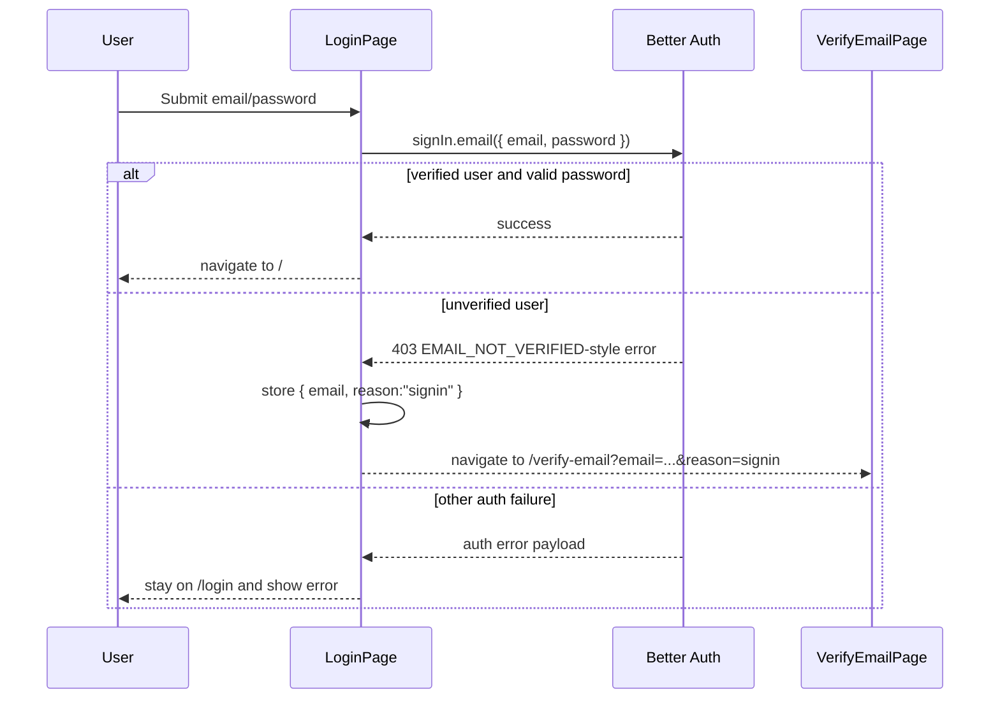

# Login And Session

This document explains password sign-in, unverified-email handling, session display, and sign-out.

## Purpose

The login sub-feature lets the browser authenticate directly against the auth service, but it does not treat sign-in as a single straight-line success/failure action.

Current behavior is deliberately split into these cases:

- verified user with correct password -> sign in and navigate home
- unverified user with correct password -> block sign-in, send a fresh OTP, redirect to verify-email
- other auth failure -> stay on login and render an error

The slice therefore treats login as an entrypoint into session creation, not as the sole moment that session creation can happen.

## Primary Files

### Web

- `apps/web/src/routes/login.tsx`
- `apps/web/src/domains/identity/authentication/ui/login-page.tsx`
- `apps/web/src/domains/identity/authentication/ui/auth-client.ts`
- `apps/web/src/domains/identity/authentication/ui/email-verification-flow.ts`
- `apps/web/src/domains/identity/authentication/ui/verify-email-page.tsx`
- `apps/web/src/domains/identity/authentication/ui/home-session-card.tsx`
- `apps/web/src/domains/identity/authentication/ui/auth-pages.test.tsx`
- `apps/web/src/domains/identity/authentication/ui/auth-client.test.ts`

### Auth

- `apps/auth/src/domains/identity/authentication/infra/auth.ts`
- `apps/auth/src/domains/identity/authentication/routes.ts`
- `apps/auth/src/app.test.ts`
- `apps/auth/src/domains/identity/authentication/infra/auth.test.ts`

## Flow Overview



## Browser-Side Login Behavior

The login page lives in `apps/web/src/domains/identity/authentication/ui/login-page.tsx`.

Current local steps:

1. prevent default form submit
2. read `email` and `password`
3. call `authClient.signIn.email({ email, password })`
4. inspect the result

Success behavior:

- navigate to `/`

Default failure behavior:

- render `result.error.message`
- fallback message: `Unable to sign in with those credentials.`

## Unverified Sign-In Branch

This is the most important non-obvious branch.

The login page uses this detector:

```ts
error?.status === 403 &&
  (error.code === "EMAIL_NOT_VERIFIED" ||
    error.message === "Email not verified")
```

The `EMAIL_NOT_VERIFIED` code path is covered in local tests. The string-message fallback is a defensive branch and more brittle.

If it matches, the browser does not render the error on `/login`.
Instead it:

1. stores:

```ts
{ email, reason: "signin" }
```

2. navigates to:

```ts
/verify-email?email=<email>&reason=signin
```

Why this exists:

- the product does not want unverified sign-in to feel like a dead end
- Better Auth is configured to send a fresh verification OTP on sign-in for unverified users
- the verify-email page becomes the recovery surface for both signup and blocked sign-in

Tradeoff:

- the login page is coupled to Better Auth error shape
- if that code/message contract changes upstream, redirect behavior can silently break

## Auth-Side Login Semantics

These come from `apps/auth/src/domains/identity/authentication/infra/auth.ts`.

Current relevant rules:

- email/password auth enabled
- email verification required before sign-in
- verification emails sent on sign-in for unverified users

What auth does on unverified sign-in:

- deny password sign-in
- return a 403-style error payload
- trigger a fresh verification OTP email

This is asserted in `apps/auth/src/app.test.ts` by:

- checking the sign-in response status is `403`
- checking the response JSON contains a code
- checking that the signup-verification OTP email mock is called once

## Session Display And Sign-Out

The web app uses the Better Auth React client for session state.

Relevant file:

- `apps/web/src/domains/identity/authentication/ui/home-session-card.tsx`

Current session states:

- pending -> session check pending state in `home-session-card.tsx`
- signed in -> show `session.user.email`
- signed out -> show Login and Sign up buttons

Sign-out behavior:

- call `authClient.signOut()`
- if sign-out fails, display `result.error.message` or `Unable to sign out right now.`

Important implication:

- session display is not custom server-rendered auth state
- it relies on Better Auth client state in the browser

## Auth Base URL Resolution Matters To Login

Relevant files:

- `apps/web/src/domains/identity/authentication/ui/auth-client.ts`
- `apps/web/src/domains/identity/authentication/ui/auth-client.test.ts`
- `apps/web/src/routes/__root.tsx`

Login works only if the browser is targeting the correct auth service origin.

Resolution order:

1. runtime HTML dataset value
2. `VITE_AUTH_BASE_URL`
3. direct-localhost fallback
4. Portless fallback

If you misconfigure this, the login page may still render normally but all sign-in requests will go to the wrong service or wrong origin.

## Decision Paths

### Successful sign-in

Behavior:

- auth client call succeeds
- page navigates to `/`
- session UI later reflects the signed-in state

### Unverified-email sign-in

Behavior:

- auth returns `403`
- web matches `EMAIL_NOT_VERIFIED` logic
- browser stores verification flow with `reason: "signin"`
- browser navigates to verify-email

### Other auth failure

Behavior:

- page stays on `/login`
- page shows the auth error message

### Already signed-in user visiting the login page

Current state:

- there is no dedicated redirect-away logic in `login-page.tsx`
- the session-aware UI lives on the home page, not in the route guard for `/login`

If the product later wants "logged-in users should never see /login," that is a new behavior change, not a refactor.

## Why The Slice Works This Way

### Direct browser-to-auth integration

Reason:

- the repo wants auth rules concentrated in `apps/auth`
- the web app should not proxy or reimplement auth semantics

Result:

- route files stay thin
- the auth client becomes the stable integration boundary

### Verification as part of login recovery

Reason:

- users who signed up but never verified should not be forced to restart from signup
- the same verify-email page can complete the login journey later

Tradeoff:

- login now depends on verify-email semantics and browser flow-state logic

### Session rendered from the client

Reason:

- Better Auth React client already exposes `useSession`
- the current app is simple enough to rely on that directly

Tradeoff:

- less custom session code
- stronger coupling to the Better Auth client contract

## Caveats

- The unverified-email detector in `login-page.tsx` is partly string-based.
- Successful login always navigates to `/`; there is no return-to-intended-destination behavior.
- The verify-email flow shares browser state and UI with signup-triggered verification. Changing it affects login too.
- Session UI is lightly covered compared with the auth service integration tests.
- Cross-origin cookie behavior depends on `BETTER_AUTH_URL`, trusted origins, and SameSite policy lining up correctly.

## Tests To Read Before Editing Login

- `apps/web/src/domains/identity/authentication/ui/auth-pages.test.tsx`
- `apps/web/src/domains/identity/authentication/ui/auth-client.test.ts`
- `apps/auth/src/app.test.ts`
- `apps/auth/src/domains/identity/authentication/infra/auth.test.ts`

If login starts failing in confusing ways, check URL resolution, trusted origins, and cookie policy before changing UI logic.
