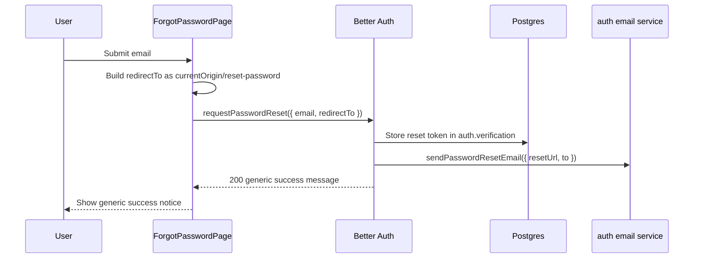
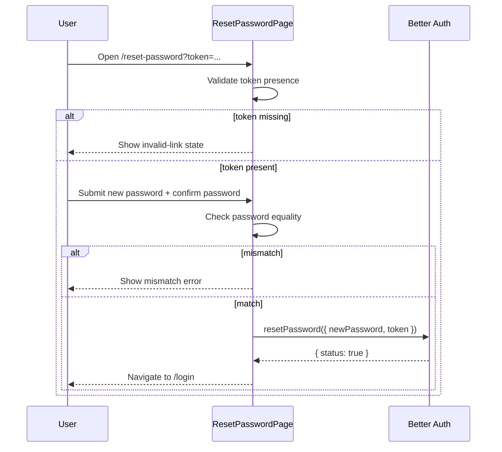

# Password Reset

This document explains the password reset sub-feature from reset-link request to submitting a new password.

## Purpose

The password reset flow exists to let users recover access without putting token issuance or password mutation logic into the web app.

Current design:

- the web app gathers input and navigates the user
- the auth app issues reset tokens and consumes them
- the shared email package renders and sends the reset email

## Primary Files

### Web

- `apps/web/src/routes/forgot-password.tsx`
- `apps/web/src/routes/reset-password.tsx`
- `apps/web/src/domains/identity/authentication/ui/forgot-password-page.tsx`
- `apps/web/src/domains/identity/authentication/ui/reset-password-page.tsx`
- `apps/web/src/domains/identity/authentication/ui/auth-pages.test.tsx`
- `apps/web/src/domains/identity/authentication/ui/auth-client.ts`

### Auth

- `apps/auth/src/domains/identity/authentication/infra/auth.ts`
- `apps/auth/src/domains/identity/authentication/infra/email-service.ts`
- `apps/auth/src/app.test.ts`
- `apps/auth/src/domains/identity/authentication/infra/auth.test.ts`
- `apps/auth/src/domains/identity/authentication/infra/email-service.test.ts`

### Shared email layer

- `packages/email/src/contracts.ts`
- `packages/email/src/service.ts`
- `packages/email/src/templates/password-reset.ts`

## Request-Reset Flow

The web page does not expose whether the email exists.

### Browser behavior

The page in `apps/web/src/domains/identity/authentication/ui/forgot-password-page.tsx`:

- reads the email from the form
- builds `redirectTo` from `window.location.origin + "/reset-password"`
- falls back to `http://localhost:3000/reset-password` when `window` is unavailable
- calls `authClient.requestPasswordReset({ email, redirectTo })`

Current success message in the UI:

- `If the account exists, check your email for a reset link.`

Current failure message fallback:

- `Unable to request a password reset.`

### Auth behavior

The auth app does not implement a custom password-reset route wrapper.

Relevant file:

- `apps/auth/src/domains/identity/authentication/infra/auth.ts`

Password reset is enabled via Better Auth's `sendResetPassword` hook.

Current auth behavior:

- Better Auth generates the reset URL and token
- auth forwards the generated URL to `authenticationEmailService.sendPasswordResetEmail({ resetUrl: url, to: user.email })`
- failures in email delivery are logged, not surfaced through the auth response

## Reset-Link Shape

The integration test in `apps/auth/src/app.test.ts` proves that the emailed reset URL currently contains:

- `/api/auth/reset-password/`
- the encoded frontend redirect target (`http://localhost:3000/reset-password` in tests)
- the generated token

This means the current model is:

- the auth service sends an auth-hosted reset link
- that link carries the web reset page as a redirect target
- the intended handoff is that the web reset page receives the token after the auth-hosted reset route runs

The web app is not constructing the auth-hosted reset URL itself.

## Reset-Password Submit Flow

### Missing-token branch

If the route does not receive a string token, `apps/web/src/routes/reset-password.tsx` coerces it to `""`.

Then `apps/web/src/domains/identity/authentication/ui/reset-password-page.tsx` renders an invalid-link state instead of the form.

Current UX:

- title: `Reset link invalid`
- CTA: `Request a new link`

### Present-token branch

Current local behavior:

- require `newPassword === confirmPassword`
- call `authClient.resetPassword({ newPassword, token })`
- on success, navigate to `/login`
- on failure, show backend message or `Unable to reset your password.`

## Relationship To Verification And Login

The password reset flow lives inside a larger auth model where email verification is still required before sign-in.

Relevant evidence from `apps/auth/src/app.test.ts`:

- after reset, the test verifies the email before proving that the new password signs in successfully
- the old password no longer works
- the new password does work after verification

Important caveat:

- the test does not prove that password reset itself verifies the email
- reset and email verification remain separate state machines in the current design

## Why The Slice Works This Way

### Generic request response

Reason:

- the product wants enumeration-resistant request-reset UX
- both the auth response and web success message are intentionally generic

This is a deliberate contrast with duplicate signup, which is intentionally explicit.

### Auth-owned reset URL generation

Reason:

- reset tokens and reset endpoints are security-sensitive
- Better Auth already owns the token lifecycle
- the web app should not synthesize or validate reset tokens on its own

### Thin web pages

Reason:

- the web app only needs to collect email/password input and hand off to auth
- the slice avoids moving auth state transitions into TanStack route handlers or server actions

### Fire-and-forget email delivery

Reason:

- auth requests should not fail just because the provider is temporarily unavailable

Tradeoff:

- users can be told to check their email even when the provider failed
- operational monitoring matters more than synchronous UX feedback

## Caveats

- The invalid-link UI only handles missing tokens locally. Present-but-invalid tokens rely on Better Auth error messages.
- The web app surfaces raw backend error messages for reset failures when available.
- The console email transport logs full payloads in local development, including reset URLs.
- `WEB_BASE_URL` is parsed in auth env, but the current reset-email URL used by tests comes from Better Auth-generated URLs, not from custom app-side composition.
- There is no repo-local assertion about session revocation semantics after password reset.

## Tests To Read Before Editing Password Reset

- `apps/web/src/domains/identity/authentication/ui/auth-pages.test.tsx`
- `apps/auth/src/app.test.ts`
- `apps/auth/src/domains/identity/authentication/infra/auth.test.ts`
- `apps/auth/src/domains/identity/authentication/infra/email-service.test.ts`
- `packages/email/src/email-service.test.ts`

Those tests define the current reset request shape, email-send handoff, token redirect assumptions, and post-reset credential behavior.
