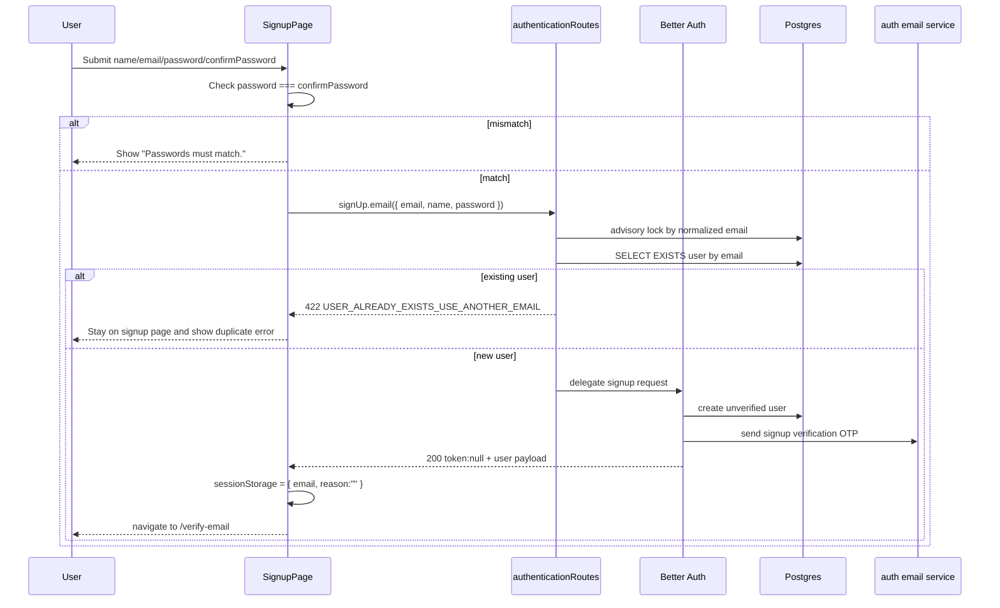

# Signup And Account Creation

This document explains the signup sub-feature from browser form submission to OTP verification handoff.

## Purpose

Signup creates an email/password account, but it does not give the user a usable authenticated session yet.

The intended product flow is:

1. collect name, email, and password in the web app
2. create an unverified auth user in the auth service
3. send a verification OTP immediately
4. navigate into `/verify-email`
5. only establish a session after OTP verification succeeds

## Primary Files

### Web

- `apps/web/src/routes/signup.tsx`
- `apps/web/src/domains/identity/authentication/ui/signup-page.tsx`
- `apps/web/src/domains/identity/authentication/ui/email-verification-flow.ts`
- `apps/web/src/domains/identity/authentication/ui/auth-pages.test.tsx`

### Auth

- `apps/auth/src/domains/identity/authentication/routes.ts`
- `apps/auth/src/domains/identity/authentication/routes.test.ts`
- `apps/auth/src/domains/identity/authentication/infra/auth.ts`
- `apps/auth/src/domains/identity/authentication/infra/auth.test.ts`
- `apps/auth/src/app.test.ts`

## End-To-End Flow



## Web Behavior

The web entrypoint is `apps/web/src/domains/identity/authentication/ui/signup-page.tsx`.

Current form fields:

- `name`
- `email`
- `password`
- `confirmPassword`

Current local logic:

- the page blocks submission locally if the two password fields differ
- there is no local minimum-length enforcement beyond the field description text
- the page calls `authClient.signUp.email({ email, name, password })`

Current success behavior:

- clear the submitting state
- persist browser flow state with:

```ts
{ email, reason: "" }
```

- navigate to `/verify-email?email=<email>&reason=`

Current failure behavior:

- stay on signup page
- render `result.error.message` when provided
- otherwise render `Unable to create your account.`

## Auth Behavior

The auth wrapper for signup lives in `apps/auth/src/domains/identity/authentication/routes.ts`.

The wrapper only intercepts:

- `POST /api/auth/sign-up/email`

It does three important things before Better Auth sees the request.

### 1. Parse and normalize the email

Supported payload shapes:

- JSON
- `application/x-www-form-urlencoded`

Normalization:

- `trim()`
- `toLowerCase()`

Malformed body handling:

- parse errors are swallowed
- malformed payloads fall through to Better Auth

That last point is deliberate. The route wrapper enforces duplicate semantics only when it can safely identify the email. It does not replace Better Auth request validation.

### 2. Serialize concurrent signup attempts for the same email

The wrapper acquires a Postgres advisory lock using the normalized email as the lock key.

Why:

- a naive `SELECT EXISTS` precheck is racy under concurrency
- two requests can both pass the precheck before either user row is created
- the advisory lock makes one request win, then forces the second to see the created row

### 3. Reject duplicates explicitly

If the email already exists, auth returns:

```json
{
  "code": "USER_ALREADY_EXISTS_USE_ANOTHER_EMAIL",
  "message": "User already exists. Use another email."
}
```

with HTTP `422`.

This is not Better Auth's generic existing-user behavior. It is a slice-owned product decision.

## Better Auth Semantics Used By Signup

Relevant file:

- `apps/auth/src/domains/identity/authentication/infra/auth.ts`

Current signup-related settings:

- `emailAndPassword.enabled = true`
- `emailAndPassword.autoSignIn = false`
- `emailAndPassword.requireEmailVerification = true`
- `emailVerification.sendOnSignUp = true`
- `emailVerification.autoSignInAfterVerification = true`
- email OTP plugin overrides default email verification

What this means in practice:

- signup succeeds without creating a usable browser session
- Better Auth creates an unverified user
- OTP email delivery is triggered immediately
- successful OTP verification later returns a token and verified user payload, with auth configured to auto-sign in after verification

## OTP Delivery As Part Of Signup

Signup OTP delivery is wired in `apps/auth/src/domains/identity/authentication/infra/auth.ts`.

Plugin behavior:

- `sendVerificationOTP({ email, otp, type })`

Auth app behavior:

- forwards to `authenticationEmailService.sendSignupVerificationOtpEmail({ code: otp, to: email })`

Shared email package contract:

- `packages/email/src/contracts.ts`
- `packages/email/src/service.ts`

Current OTP policy:

- 6 digits
- 5 minute expiry
- 3 attempts
- hashed storage

## Success Path In Tests

The strongest integration evidence is in `apps/auth/src/app.test.ts`.

Current signup success assertions:

- response status is `200`
- response body includes:
  - `token: null`
  - `user.email`
  - `user.name`
- the OTP email mock is called exactly once
- the OTP format matches six digits

The strongest web-side assertion is in `apps/web/src/domains/identity/authentication/ui/auth-pages.test.tsx`.

Important caveat:

- the test named `navigates home after successful signup` is stale
- the assertions prove the opposite: successful signup goes to `/verify-email`

Future editors should trust the assertions, not the test name.

## Decision Paths

### Password mismatch

Behavior:

- handled purely in the browser
- no auth request is made
- page shows `Passwords must match.`

### Signup success

Behavior:

- auth returns 200
- browser stores verification flow state
- browser navigates to `/verify-email`

### Duplicate signup

Behavior:

- auth returns `422 USER_ALREADY_EXISTS_USE_ANOTHER_EMAIL`
- browser stays on `/signup`
- browser shows `User already exists. Use another email.`
- no OTP email is sent

### Malformed signup payload

Behavior:

- the auth route wrapper does not try to own validation
- malformed request falls through to Better Auth
- Better Auth remains the source of truth for request validation errors

### Concurrent duplicate signup attempts

Behavior:

- one request acquires the lock and proceeds
- the second waits
- once the first request creates the user, the second returns 422

This behavior is encoded in `apps/auth/src/domains/identity/authentication/routes.test.ts`.

## Why The Slice Works This Way

### No auto-sign-in on signup

Reason:

- the product wants email ownership established before the first real session
- the auth state model is simpler when verification is part of the initial onboarding path

### Explicit duplicate rejection

Reason:

- greenfield product requirement changed toward explicit rejection
- Better Auth's generic-success duplicate path did not match that requirement

Tradeoff:

- clearer UX
- weaker privacy than an enumeration-resistant generic response

### Route-level lock and precheck instead of blind delegation

Reason:

- product wants deterministic duplicate behavior under concurrency
- raw DB uniqueness errors are not the desired product contract

Tradeoff:

- more complexity in the auth wrapper
- stronger product-level control over the response shape

### SessionStorage flow state after signup

Reason:

- the verify-email page needs local browser context to decide whether resend should be shown
- signup and sign-in share the same verify-email surface but not the same explanation text

Tradeoff:

- simple and local
- tab-scoped, user-controlled, not durable across devices or sessions

## Caveats

- Duplicate signup is intentionally explicit and not enumeration-resistant.
- The signup page text says "Use at least 8 characters," but the page does not enforce that locally.
- The browser does not pass an explicit `callbackURL` in signup requests, although auth integration tests do when calling the raw endpoint directly.
- OTP email delivery is fire-and-forget. Signup can succeed even if the provider fails to send the OTP.
- The page and tests assume email is the primary auth identity. If that changes, the flow state shape and route wrapper logic both need review.

## Tests To Read Before Editing Signup

- `apps/web/src/domains/identity/authentication/ui/auth-pages.test.tsx`
- `apps/auth/src/app.test.ts`
- `apps/auth/src/domains/identity/authentication/routes.test.ts`
- `apps/auth/src/domains/identity/authentication/infra/auth.test.ts`

If you change signup behavior, update all four levels together: web UI, auth route wrapper, Better Auth configuration assumptions, and integration tests.
